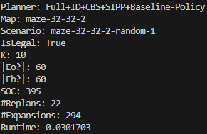
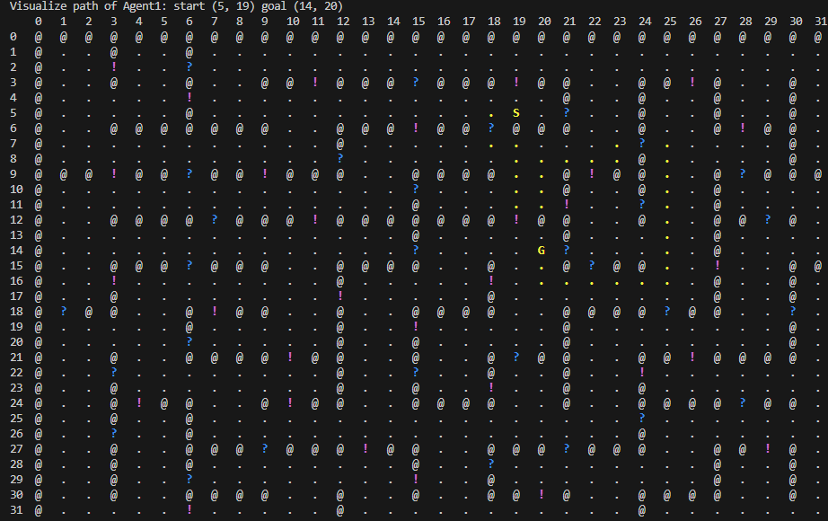
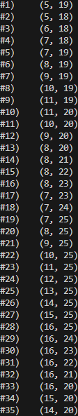

# MAPF-IM: Online Planning for Multi Agent Path Finding in Inaccurate Maps
In MAPF-IM the input graph may be inaccurate, containing non-existent edges or missing edges present in the environment. Agents can verify the existence or non-existence of an edge only by moving close to it. To navigate such maps, we propose an online approach where planning and execution are interleaved. As agents gather new information about the environment over time, they replan accordingly. 
The proposed algorithm were presented at IROS-24 conference and has many practical applications, especially in the field of autonomous robotics.


## Content

This repository includes a script (**[run.sh](./run.sh/)**) that helps manage the execution of the MAPF-IM library and executable. The script takes care of finding necessary files, building the executable ((**[build.sh](./build.sh/)**)) if needed, and running it with the specified settings.

The content related to the MAPF-IM algorithms is organized into the following folders:

- **[benchmarks](./benchmarks/):** Contains input files (maps and scenarios) required by the MAPF-IM algorithms. These files were used in the experiments described in the paper.
  
- **[exe-src](./exe-src/):** Includes the main source file used to run the MAPF-IM algorithms.

- **[lib-src](./lib-src/):** Contains the source code for MAPF-IM, including the frameworks, high/low level planners, and policies proposed in the paper.

- **[mapf-im-output](./mapf-im-output/):** Holds log files from the MAPF-IM algorithm executions, detailing the actions of each agent at each timestep.


## Getting started

### Prerequisites

Before running this project, ensure that your development environment has the following prerequisites installed:

1. **C++23 Support**
   - Install GCC 12 or higher to ensure compatibility with C++23 features.

2. **Boost Libraries**
   - Ensure Boost libraries are installed (`libboost-all-dev`).

3. **CMake 3.22 or Higher**
   - Required for building the project.

### Installation on Ubuntu

You can use the following commands to install all the prerequisites on an Ubuntu machine:


Update the package list
```bash
sudo apt update
```

Install GCC 12 (which supports C++23) and necessary build tools
```bash
sudo apt install -y gcc-12 g++-12 build-essential
```

Install Boost libraries
```bash
sudo apt install -y libboost-all-dev
```

Install CMake 3.22
```bash
sudo apt-get install -y software-properties-common
sudo add-apt-repository ppa:ubuntu-toolchain-r/test
sudo apt update
sudo apt install -y cmake
```

After installation, you may want to set GCC 12 as the default compiler:
```bash
sudo update-alternatives --install /usr/bin/gcc gcc /usr/bin/gcc-12 60 --slave /usr/bin/g++ g++ /usr/bin/g++-12
```
This will ensure that your environment is ready to build and run the project.

### Installing
Download current repository to your local machine:
```bash
git clone https://github.com/NirMalka4/MAPF-IM.git
```

From the cloned project directory, apply the run.sh script:
```bash
cd PATH_TO_CLONED_PROJECT
chmod +x ./run.sh
./run.sh
```


## Script Available Options

- `-m, --map_file_path <map_file_path>`: Path to the map file (default: `room-64-64-8.map`). The script will search for this file in any subdirectory of the current working directory.
- `-s, --scenario_file_path <scenario_file_path>`: Path to the scenario file (default: `room-64-64-8-random-1.scen`). The script will search for this file in any subdirectory of the current working directory.
- `-o, --output_file_path <output_file_path>`: Path to the output directory (default: `mapf-im-output`). If the directory does not exist, the script will create it.
- `-k <number_of_agents>`: Number of agents (default: 10).
- `-f <framework_name>`: Framework name (default: `full_id_planner`). Options: `full_planner`, `full_id_planner`, `local_planner`, `local_id_planner`.
- `-hl, --high_level_planner_name <high_level_planner_name>`: High-level planner name (default: `cbs`). Options: `pp`, `cbs`.
- `-ll, --low_level_planner_name <low_level_planner_name>`: Low-level planner name (default: `sipp`). Options: `sipp`, `ees_sipp`.
- `-p <policy_name>`: Policy name (default: `baseline`). Options: `risk_averse`, `explorative`, `hybrid`, `baseline`.
- `-t <timeout>`: Max runtime measured in seconds (default: 300).
- `-vp, --visualize_path <visualize_path>`: Whether to visualize the final path an agent traversed (default: 1). Options: `1` (true), `0` (false).
- `-pp, --print_path <print_path>`: Whether to print the vertex an agent traversed in each timestep (default: 1). Options: `1` (true), `0` (false).
- `-h, --help`: Display help message and exit.

### Usage example

```bash
./script_name.sh -m "custom_map.map" -s "custom_scenario.scen" -o "output_dir" -k 20 -f "full_id_planner" -hl "cbs" -ll "sipp" -p "risk_averse" -t 500 -vp 0 -pp 1
```

## Outputs
An execution will output to the console the followings:

**Summary**  
  
presents the results of running a MAPF-IM algorithm

**Visualize Path**  
  
shows a visual representation of the path taken by an agent in an environment.
The grid visualizes a pathfinding scenario with different types of terrain represented by specific characters. Here's what each character means:
- **`.` (empty)**: An open and traversable location where the agent can move freely.
- **`S` (agent)**: The starting position of the agent.
- **`G` (goal)**: The goal position that the agent is trying to reach.
- **`?` (maybe_blocked)**: The agent initially thinks this spot is blocked and can't be reached, but it turns out to be open and traversable.
- **`!` (maybe_open)**: The agent initially thinks this spot is open and can be traversed, but it turns out to be blocked and untraversable.
- **`@` (wall)**: A solid obstacle that the agent cannot pass through.
This grid represents the environment in which the agent navigates from its start position (`S`) to its goal (`G`), while dealing with assumptions about certain areas that might turn out to be incorrect.

**Visualize Path**  
  
lists the sequence of coordinates that an agent follows from its start position to its goal in the grid environment. Each line represents a step the agent takes, showing the exact coordinates it visits in order.